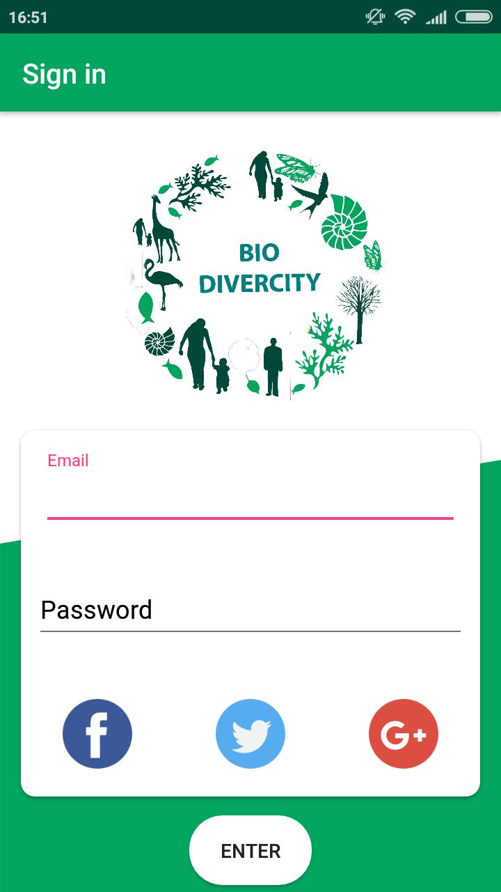
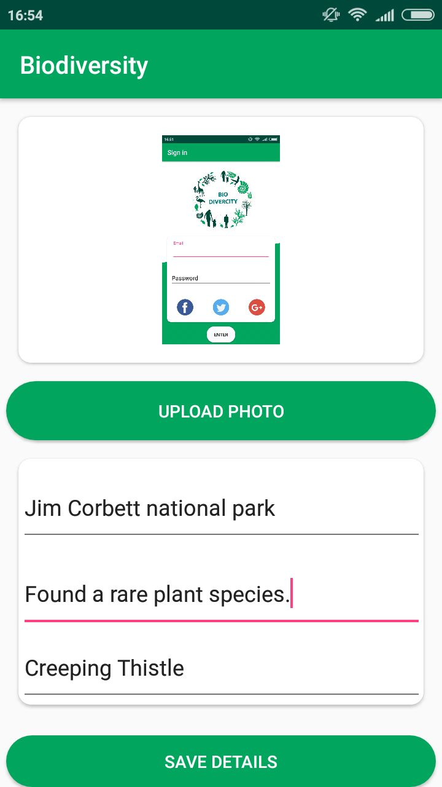
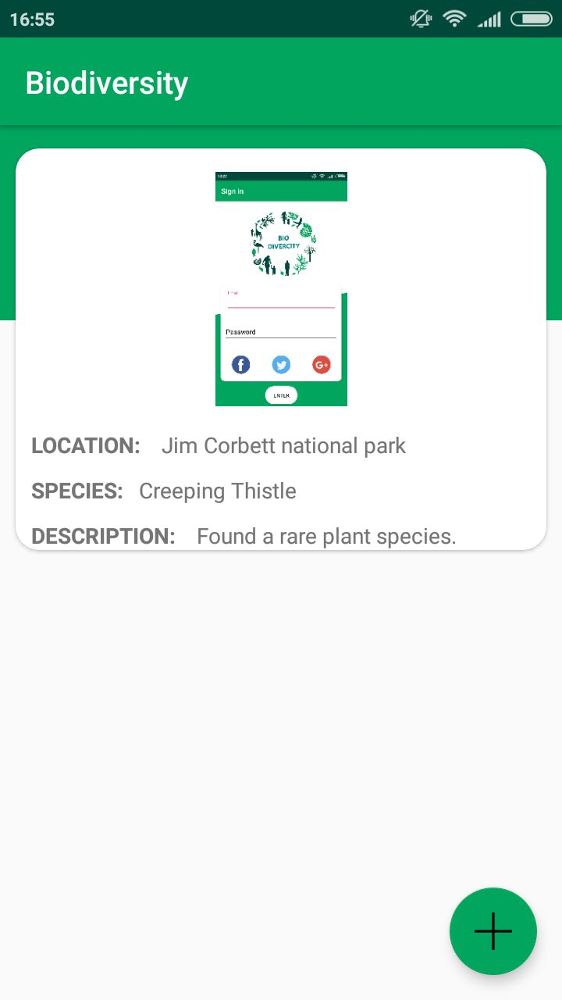

# BIODIVERCITY - All for one and one for all

The name of the Mobile App is “BIODIVERCITY”. 
This is a App which enhances the experience of the nature lovers mainly the animals, birds and the plants by providing real 
time information of different species and their location. 

This would also help you to plan your trek or journey so that you can see various species during the time.
It will also make the users enriched about the different species and their details.

# SCREENSHOTS

<table>
  <tr>
    <td></td>
    <td></td>
    <td></td>
  </tr>
 </table>